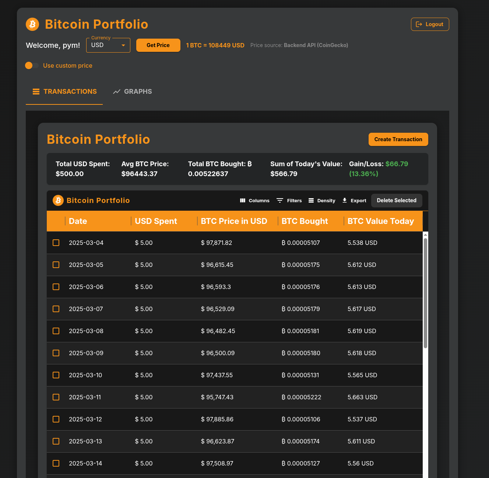
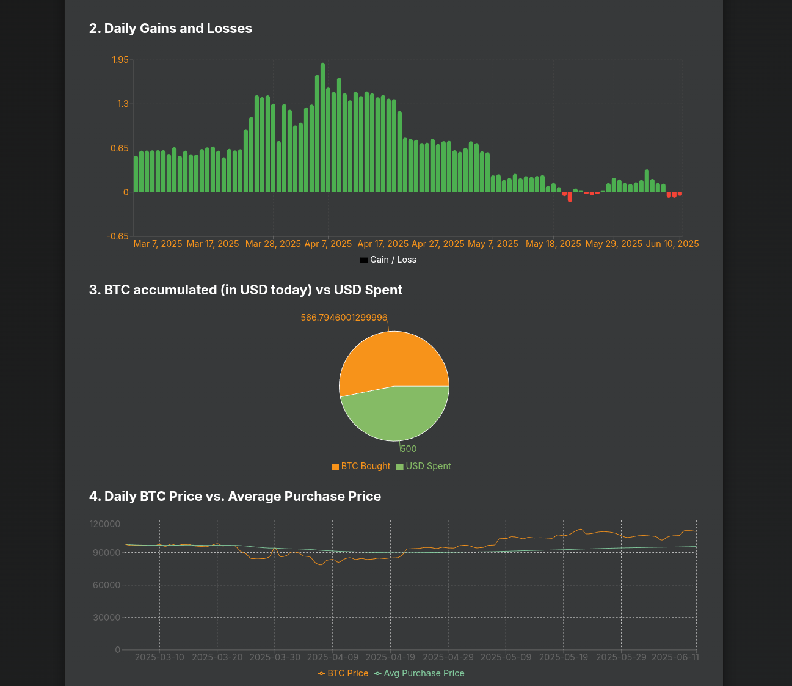

# Bitcoin DCA Tracker

_A modern, multi-user Bitcoin DCA (Dollar Cost Averaging) tracker. Log your recurring BTC purchases, visualize your DCA performance, and track your portfolio value over time. Built with FastAPI, React, and PostgreSQL._

---

## Why Bitcoin DCA Tracker?
Dollar Cost Averaging (DCA) is your stealthy rebellion against the tyranny of market volatility—buying Bitcoin bit by bit, like a true free-market warrior dodging the central banks’ chaos. This app is your trusty ledger in the war against fiat inflation, making it stupid-simple to track your recurring BTC buys, calculate your average cost basis, and spy on your portfolio’s glorious ascent. Whether you’re a fresh cypherpunk or a battle-hardened HODLer, Bitcoin DCA Tracker arms you with the data to stick it to the system and keep your crypto stash growing.

---
## Features

- 📈 **DCA & HODL Tracking:** Log your Bitcoin purchases and see your average cost, total holdings, and portfolio value.
- 👥 **Multi-User Support:** Secure registration, login, and personal dashboards for each user.
- 🔒 **JWT Authentication:** Secure endpoints and user data.
- ⚡ **Real-Time Valuation:** Instantly see your portfolio’s value with up-to-date BTC prices.
- 🗓️ **Transaction History:** View, add, and manage your BTC transactions.
- 🌐 **Modern Stack:** FastAPI (Python), React (JavaScript), PostgreSQL, Docker.
- 🛠️ **Easy Setup:** Run locally with Docker Compose.

---

## Screenshots



---

## Getting Started

### Prerequisites

- [Docker](https://www.docker.com/get-started)
- [Docker Compose](https://docs.docker.com/compose/)

### Quick Start

1. **Clone the repository:**

   ```bash
   git clone https://github.com/mateuspim/bitcoin-hodl.git
   cd bitcoin-hodl
   ```

2. **Copy and edit environment variables:**

   ```bash
   cp backend/.env.example backend/.env
   # Edit backend/.env as needed
   ```

3. **Start the app:**

   ```bash
   docker compose up --build
   ```

4. **Access the app:**

   - Frontend: [http://localhost:3000](http://localhost:3000)
   - API docs: [http://localhost:8000/docs](http://localhost:8000/docs)

---

## Usage

1. **Register a new account.**
2. **Log in to your dashboard.**
3. **Add your BTC purchases**
4. **View your average cost, total holdings, and portfolio value.**
5. **Reset your password if needed.**

---

## Project Structure

```
bitcoin-hodl/
├── backend/      # FastAPI app (Python)
├── frontend/     # React app (JavaScript)
├── docker-compose.yml
└── README.md
```

---

## Tech Stack

- **Backend:** FastAPI, SQLAlchemy, FastAPI Users, asyncpg
- **Frontend:** React, fetch API
- **Database:** PostgreSQL
- **Auth:** JWT (JSON Web Tokens)
- **Containerization:** Docker, Docker Compose

---

## API

- **API docs available at** [http://localhost:8000/docs](http://localhost:8000/docs)
- Example endpoints:
  - `POST /auth/register` — Register new user
  - `POST /auth/jwt/login` — Login and get JWT token
  - `POST /auth/forgot-password` — Request password reset
  - `POST /auth/reset-password` — Reset password
  - `GET /transactions/` — List user’s transactions (auth required)
  - `POST /transactions/` — Add a new transaction (auth required)

---

## Development

### Backend

```bash
cd backend
uvicorn app.main:app --reload
```

### Frontend

```bash
cd frontend
npm install
npm run dev
```

---

## Contributing

Contributions, issues, and feature requests are welcome!
Feel free to [open an issue](https://github.com/mateuspim/bitcoin-hodl/issues) or submit a pull request.

---

## License

[MIT](LICENSE)

---

## Acknowledgements

- [FastAPI](https://fastapi.tiangolo.com/)
- [React](https://react.dev/)
- [PostgreSQL](https://www.postgresql.org/)
- [FastAPI Users](https://fastapi-users.github.io/fastapi-users/latest/)

---

## Support & Contact

Need help or want to share feedback? Reach out via:

- GitHub Issues: [https://github.com/mateuspim/bitcoin-hodl/issues](https://github.com/mateuspim/bitcoin-hodl/issues)
- Email: mateuspimsantos@gmail.com

We appreciate your support and contributions!

**Happy HODLING! 🚀**
